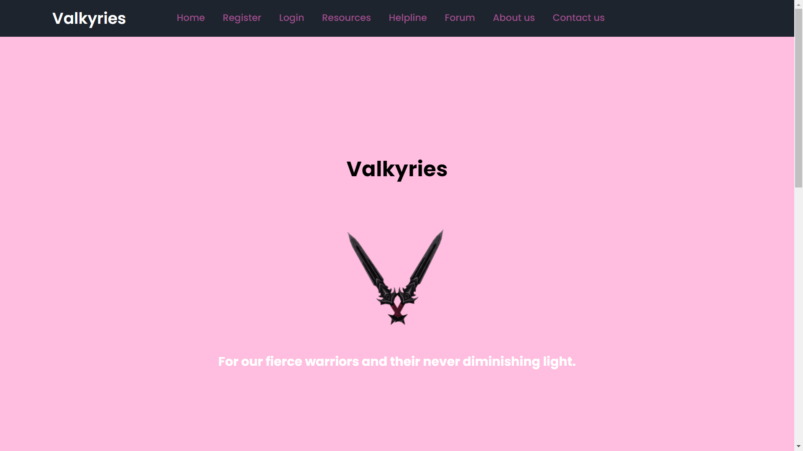
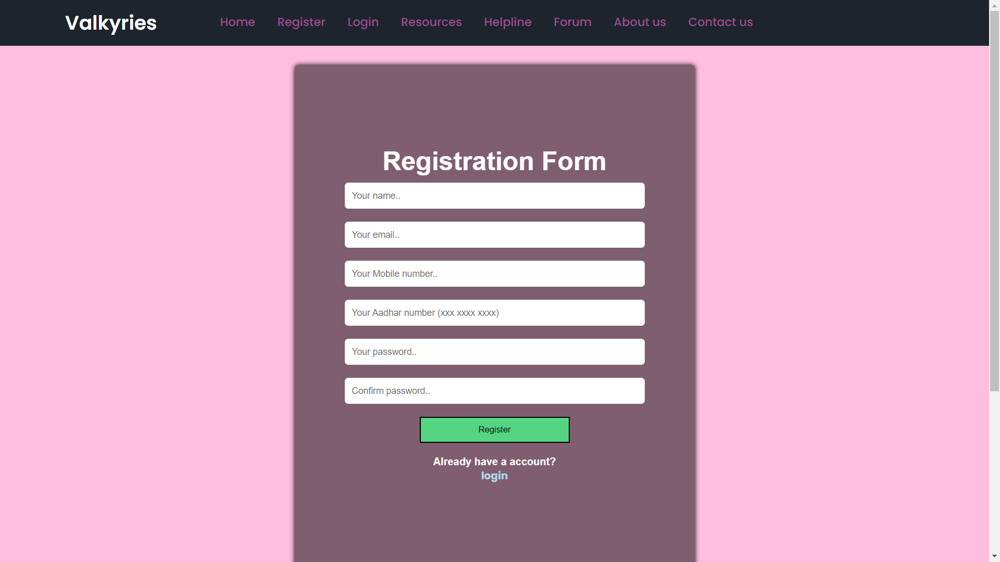
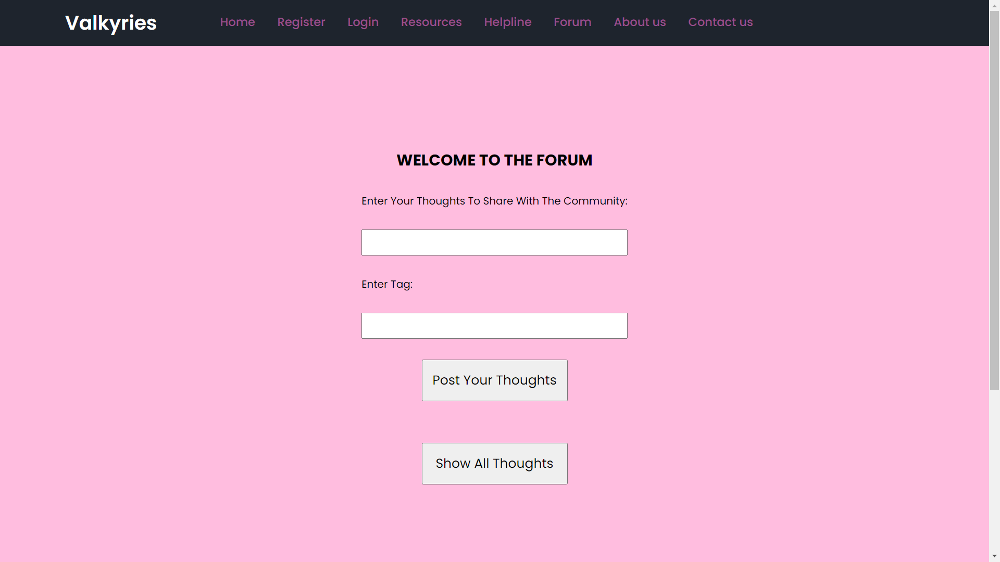
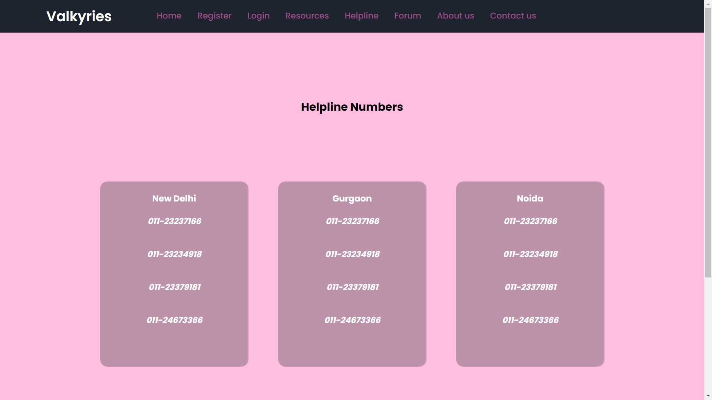
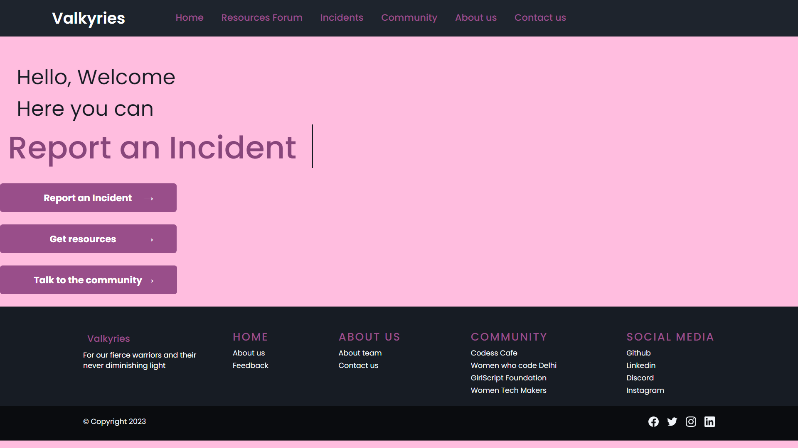

<a name="readme-top"></a>


<!-- PROJECT LOGO -->
<br />
<div align="center">
    
  </a>

  <h3 align="center">Valkyries</h3>

  <!-- <p align="center">
    An awesome README template to jumpstart your projects!
    <br />
    <a href="https://github.com/othneildrew/Best-README-Template"><strong>Explore the docs »</strong></a>
    <br />
    <br />
    <a href="https://github.com/othneildrew/Best-README-Template">View Demo</a>
    ·
    <a href="https://github.com/othneildrew/Best-README-Template/issues">Report Bug</a>
    ·
    <a href="https://github.com/othneildrew/Best-README-Template/issues">Request Feature</a>
  </p> -->
</div>

<br>
<br>
<br>


<!-- TABLE OF CONTENTS -->
<details>
  <summary>Table of Contents</summary>
  <ol>
    <li>
      <a href="#about-the-project">About The Project And Our Motivation</a>
      <ul>
        <li><a href="#built-with">Built With</a></li>
      </ul>
    </li>
    <li>
      <a href="#getting-started">Getting Started</a>
      <ul>
        <li><a href="#prerequisites">Prerequisites</a></li>
        <li><a href="#installation">Installation</a></li>
      </ul>
    </li>
    <li><a href="#usage">Usage</a></li>
    <li><a href="#contributing">Contributing</a></li>
    <!-- <li><a href="#license">License</a></li> -->
    <li><a href="#contact">Contact</a></li>
    <!-- <li><a href="#acknowledgments">Acknowledgments</a></li> -->
  </ol>
</details>


<!-- ABOUT THE PROJECT -->
## About The Project And Our Motivation





 
 


A platform that helps women report crimes and offers guidance to women about tech communities and resources. 

The motivation for creating a platform that helps women report crimes and offers guidance to women about tech communities and resources is to address the issue of women's safety in their communities. 

A platform that allows women to anonymously report crimes and connect with other women and resources in their area can help create a sense of safety and community, and empower women to take control of their own safety and well-being. 

Additionally, by offering guidance and resources related to tech communities, the platform can help women explore and access opportunities in the tech industry and further their professional development.

Overall, the motivation for creating this platform is to support and empower women in their communities and help create a safer and more inclusive environment for all.

<br>


<p align="right">(<a href="#readme-top">back to top</a>)</p>


### Built With

* [![React][React.js]][React-url]
* [![Bootstrap][Bootstrap.com]][Bootstrap-url]
* [![Node][Node.js]][Node-url]
* [![Python][Python.com]][Python-url]
* [![Flask][Flask.com]][Flask-url]

<p align="right">(<a href="#readme-top">back to top</a>)</p>


<!-- GETTING STARTED -->
## Getting Started

To get a local copy up and running follow these simple example steps.
<br>
<br>

### Prerequisites

These are some dependencies you will need
* npm
  ```sh
  npm install npm@latest -g
  ```

### Installation


1. Clone the repo
   ```sh
   git clone git@github.com:VishrutAggarwal/Valkyries.git
   ```
2. Navigate to frontend directory
    ```sh
    cd frontend
    ```
3. Install NPM packages
   ```sh
   npm install
   ```

<p align="right">(<a href="#readme-top">back to top</a>)</p>


<!-- USAGE EXAMPLES -->
<!-- ## Usage

Use this space to show useful examples of how a project can be used. Additional screenshots, code examples and demos work well in this space. You may also link to more resources.

_For more examples, please refer to the [Documentation](https://example.com)_

<p align="right">(<a href="#readme-top">back to top</a>)</p> -->


<!-- CONTRIBUTING -->
## Contributing

Contributions are what make the open source community such an amazing place to learn, inspire, and create. Any contributions you make are **greatly appreciated**.

If you have a suggestion that would make this better, please fork the repo and create a pull request. You can also simply open an issue with the tag "enhancement".
Don't forget to give the project a star! Thanks again!

1. Fork the Project
2. Create your Feature Branch (`git checkout -b feature/AmazingFeature`)
3. Commit your Changes (`git commit -m 'Add some AmazingFeature'`)
4. Push to the Branch (`git push origin feature/AmazingFeature`)
5. Open a Pull Request

<p align="right">(<a href="#readme-top">back to top</a>)</p>


<!-- LICENSE -->
<!-- ## License

Distributed under the MIT License. See `LICENSE.txt` for more information.

<p align="right">(<a href="#readme-top">back to top</a>)</p>
 -->


<!-- CONTACT -->

## Contact

### Team Links

<br>

Vishrut Aggarwal - [Vishrut Aggarwal](https://linkedin.com/in/vishrut-aggarwal)

Profile Link: [https://github.com/VishrutAggarwal](https://github.com/VishrutAggarwal)

<br>

Akanksha Kushwaha - [Akanksha Kushwaha](https://linkedin.com/in/aku1310)

Profile Link: [https://github.com/aku1310](https://github.com/aku1310)

<br>

Dhanya Hegde - [Dhanya Hegde](https://www.linkedin.com/in/dhanyahegde01)

Profile Link: [https://github.com/](https://github.com/DhanyaHegde01)

<br>

Amriti Gupta - [Amriti Gupta](https://www.linkedin.com/in/amriti-gupta-a50036229)

Profile Link: [https://github.com/](https://github.com/amritigupta)

<br>
<br>

### Project Links

<br>
<!-- Repository Link: [https://github.com/VishrutAggarwal/Valkyries](https://github.com/VishrutAggarwal/Valkyries) -->

* Demo Video Link: [Google Drive Link]()

* Deployed Site: 

<p align="right">(<a href="#readme-top">back to top</a>)</p>


<!-- ACKNOWLEDGMENTS -->
<!-- ## Acknowledgments

Use this space to list resources you find helpful and would like to give credit to. I've included a few of my favorites to kick things off!

* [Choose an Open Source License](https://choosealicense.com)
* [GitHub Emoji Cheat Sheet](https://www.webpagefx.com/tools/emoji-cheat-sheet)
* [Malven's Flexbox Cheatsheet](https://flexbox.malven.co/)
* [Malven's Grid Cheatsheet](https://grid.malven.co/)
* [Img Shields](https://shields.io)
* [GitHub Pages](https://pages.github.com)
* [Font Awesome](https://fontawesome.com)
* [React Icons](https://react-icons.github.io/react-icons/search)

<p align="right">(<a href="#readme-top">back to top</a>)</p> -->


<!-- MARKDOWN LINKS & IMAGES -->
<!-- https://www.markdownguide.org/basic-syntax/#reference-style-links -->
[contributors-shield]: https://img.shields.io/github/contributors/othneildrew/Best-README-Template.svg?style=for-the-badge
[contributors-url]: https://github.com/othneildrew/Best-README-Template/graphs/contributors
[forks-shield]: https://img.shields.io/github/forks/othneildrew/Best-README-Template.svg?style=for-the-badge
[forks-url]: https://github.com/othneildrew/Best-README-Template/network/members
[stars-shield]: https://img.shields.io/github/stars/othneildrew/Best-README-Template.svg?style=for-the-badge
[stars-url]: https://github.com/othneildrew/Best-README-Template/stargazers
[issues-shield]: https://img.shields.io/github/issues/othneildrew/Best-README-Template.svg?style=for-the-badge
[issues-url]: https://github.com/othneildrew/Best-README-Template/issues
[license-shield]: https://img.shields.io/github/license/othneildrew/Best-README-Template.svg?style=for-the-badge
[license-url]: https://github.com/othneildrew/Best-README-Template/blob/master/LICENSE.txt
[linkedin-shield]: https://img.shields.io/badge/-LinkedIn-black.svg?style=for-the-badge&logo=linkedin&colorB=555
[linkedin-url]: https://linkedin.com/in/othneildrew
[React.js]: https://img.shields.io/badge/React-20232A?style=for-the-badge&logo=react&logoColor=61DAFB
[React-url]: https://reactjs.org/
[Bootstrap.com]: https://img.shields.io/badge/Bootstrap-563D7C?style=for-the-badge&logo=bootstrap&logoColor=white
[Bootstrap-url]: https://getbootstrap.com
[Node.js]: https://img.shields.io/badge/Node-27B800?style=for-the-badge&logo=node.js&logoColor=white
[Node-url]: https://nodejs.org
[Python.com]: https://img.shields.io/badge/Python-E3E300?style=for-the-badge&logo=python
[Python-url]: https://python.org/
[Flask.com]: https://img.shields.io/badge/Flask-FFFFF0?style=for-the-badge&logo=flask&logoColor=black
[Flask-url]: https://flask.palletsprojects.com/